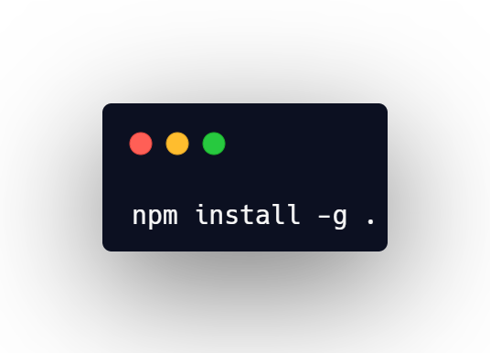

# CLI tool to start a JS project

A simple CLI tool to start a JS project including some major frameworks or vanilla and you can include Typescript.

## How to install?

Just run:

    
Then you can use the command 'spcli' in cmd.

## Tech used:

For the questions and commands in shell:
- [Inquirer](https://github.com/SBoudrias/Inquirer.js)
- [Shelljs](https://github.com/shelljs/shelljs)

To make it more pretty used:
- [Chalk](https://github.com/chalk/chalk)
- [Chalk Animation](https://github.com/bokub/chalk-animation)
- [Nanospinner](https://github.com/usmanyunusov/nanospinner)

## TODO:
- [X] Make the basic questions;
- [X] Make all the things for all options;
- [X] Add a section in README teaching how to use;
- [ ] Add to npm;

### TODO in future:
- [ ] Add tailwind option;

## License

[Creative Commons Zero v1.0 Universal](https://github.com/Franciscoborges2002/startProjectCLI/blob/main/LICENSE)